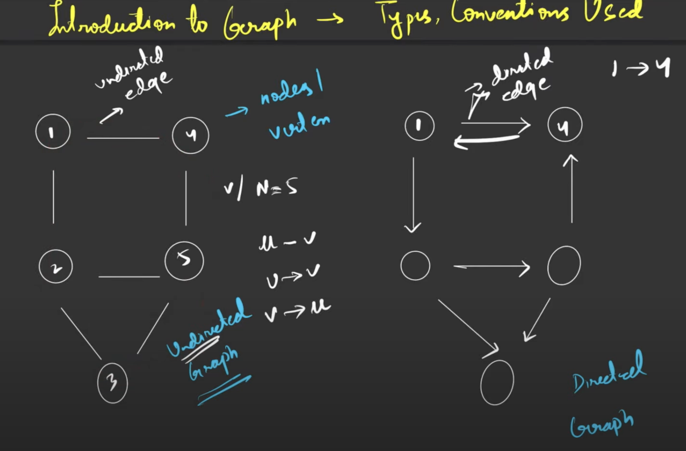
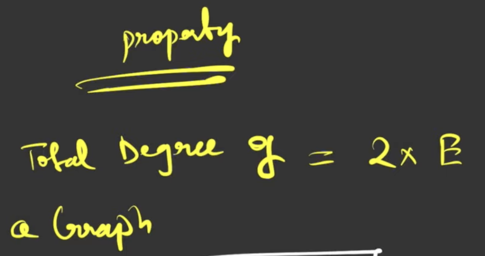
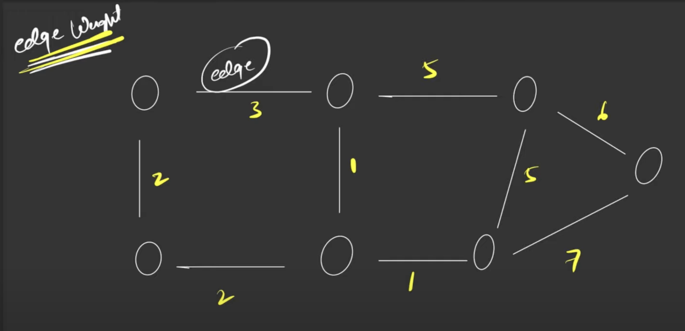

# Graphs

### Terms:

- Node/Vertex - Corner points in the graph are called nodes/vertices.
- Edge - A line joining 2 nodes is known as edge
- Path - Contains a lot of nodes and each of them are reachable. (A node cannot appear twice in a path). Adjacent nodes should have an edge between them.

Bare minimum condition for a structure to be called as graph is that it should contain nodes and edges

#### A tree is always a graph but a graph is not always a tree

### Types:

1. Undirected graph: The edges in this graph do not point in any certain direction, so if I say u -- v, it means I can go to v from u and vice versa.
2. Directed graph: All the edges in this graph are directed in nature. so if I say u -> v, it means I can go to v from u and **not** vice versa.

### Cycles in a graph

1. If you start from a node in graph, traverse the path and reach back to the node then the graph is known as a Cyclic Graph. If it has no direction edges then it is called as Undirected Cyclic Graph. If it has directional edges, it is called as Directed Cyclic Graph.
2. If there is no way to reach the starting point in a graph after traversing the path, then it is known as Acyclic Graph

### Degree of an undirected graph

The number of edges connected to a node is called the degree of that node.

#### Property of undirected graphs

Total Degree of a graph = 2 x E (where E means total number of edges)

### Degree of a directed graph

1. Indegree - the number of incoming edges to a node
2. Outdegree - the number of outgoing edges to a node

### Edge Weights

Every edge is assigned a weight.
If it is not assigned, we will assume unit weights (which means 1)

